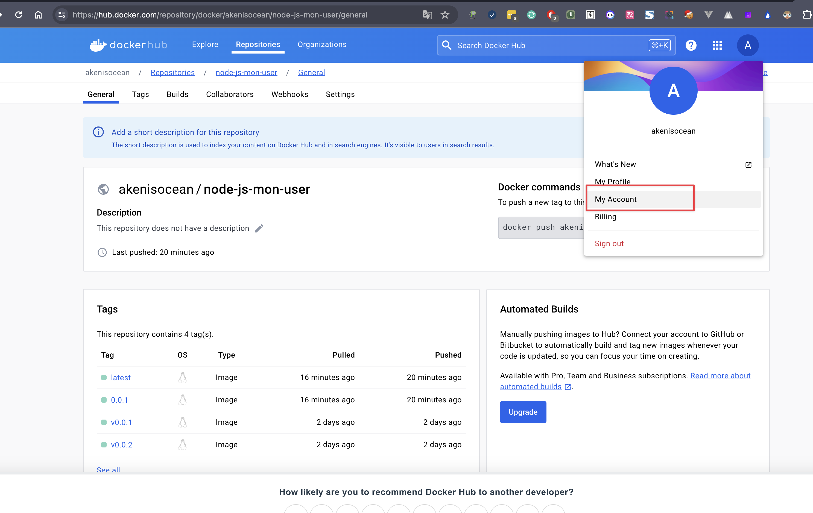
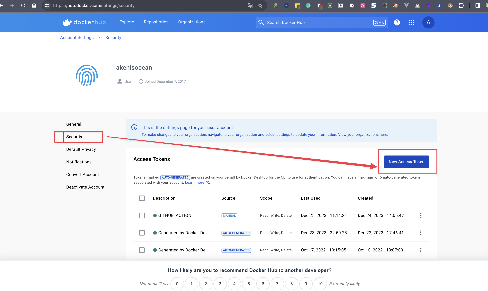
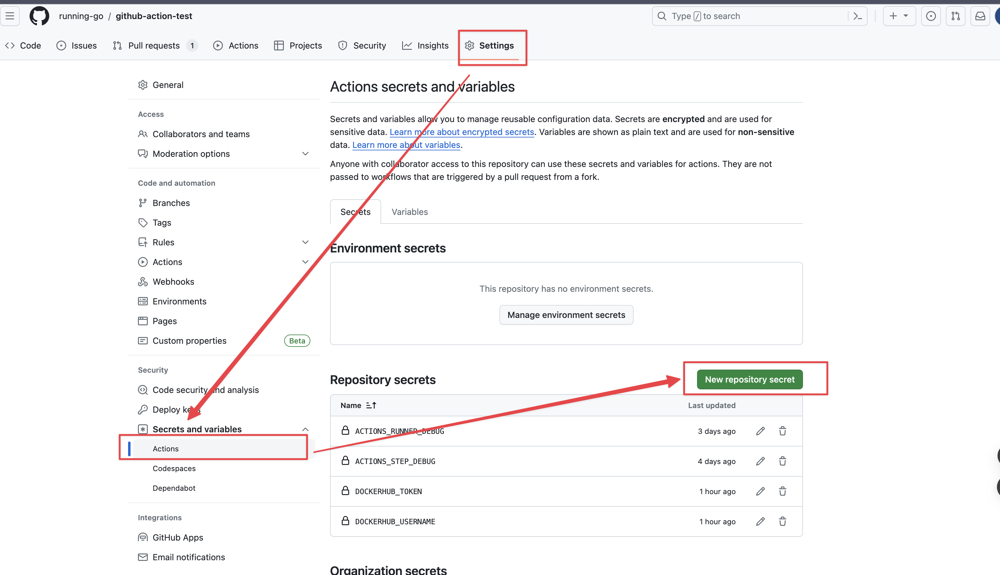

# Github Actions实现打包镜像并推送到docker hub仓库中

## 步骤
1. 登录docker hub并创建token。
2. 创建好的token放入Github Actions中的Secrets里面并设置变量.
3. 在当前项目的**.github/workflows**目录下创建yaml文件并编写文件。

### 1. 登录docker hub并创建token。




### 2. 创建好的token放入Github Actions中的Secrets里面并设置变量.


### 3. 在当前项目的**.github/workflows**目录下创建yaml文件并编写文件。
```yml
#workflow名称
name: ci
# 触发条件
on:
#github页面手动触发
  workflow_dispatch: 
#打tag触发，必须是v开头的
  push:
    tags:
      - "v*.*"
#变量配置      
env:
  #镜像名称
  IMAGE_NAME: node-js-mon-user
  #dockerHub仓库名称
  DOCKER_REGISTRY: akenisocean
jobs:
  build-image:
    #运行的环境  
    runs-on: ubuntu-latest
    env:
      TZ: Asia/Shanghai
    outputs:
      tags: ${{ steps.output-id.outputs.v }}
    steps:
      # 拉取代码，同时获取tag，如果获取不到则默认值为edge，并赋值给v变量
      - name: Checkout
        uses: actions/checkout@v4
      - name: print tag version
        id: output-id
        run: |
          VERSION=edge
          if [[ $GITHUB_REF == refs/tags/* ]]; then
            VERSION=${GITHUB_REF#refs/tags/v}
          fi
          echo "v=${VERSION}" >> $GITHUB_OUTPUT
      - name: Set up QEMU
        uses: docker/setup-qemu-action@v3    
     # Docker配置多平台环境
      - name: Set up Docker BuildX
        uses: docker/setup-buildx-action@v3        
      # 登录镜像仓库
      - name: Login Docker Hub
        uses: docker/login-action@v3
        with:
        #这里引用的变量为上一步配置的变量
          username: ${{ secrets.DOCKERHUB_USERNAME }}
          password: ${{ secrets.DOCKERHUB_TOKEN }}     
      # 打包构建并推送
      - name: Build and push
        uses: docker/build-push-action@v5
        with:
          context: .
          file: ./Dockerfile
          platforms: |
            linux/amd64
            linux/arm64
          #推送到镜像仓库  
          push: true
          # 这里会构建两个版本镜像，
          # 1.akenisocean/node-js-mon-user:latest
          # 2.  output-id步骤中获取的v，构建akenisocean/node-js-mon-user:edge或者akenisocean/node-js-mon-user:对应tag值
          tags: |
            ${{ env.DOCKER_REGISTRY }}/${{ env.IMAGE_NAME }}:${{ steps.output-id.outputs.v }}
            ${{ env.DOCKER_REGISTRY }}/${{ env.IMAGE_NAME }}:latest
```